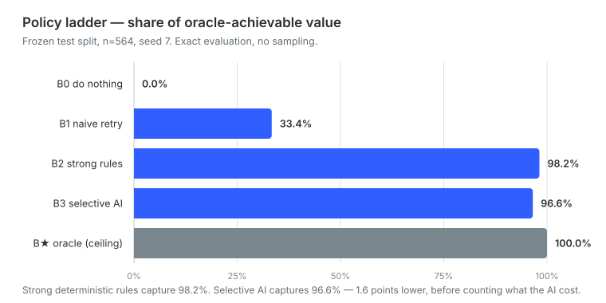
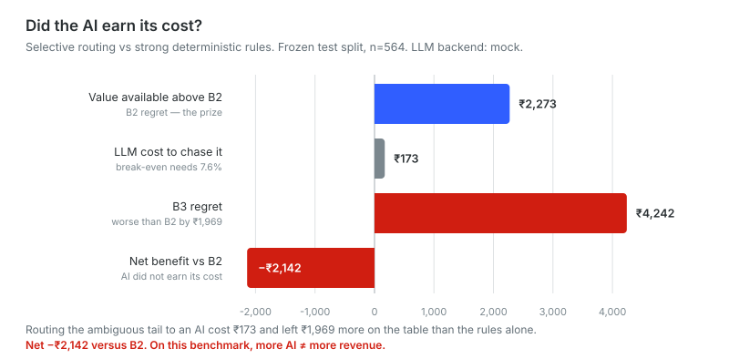

# RecoverAI

**AI revenue recovery that knows when *not* to use AI.**

When a recurring subscription charge fails, RecoverAI decides whether to retry
now, retry later, ask the customer to fix their payment method, or stop — under
deterministic compliance, retry-budget and unit-economics gates. Deterministic
rules handle every case they can settle. A model is consulted only on the
genuinely ambiguous tail, and only when the money at stake exceeds the cost of
asking. The model **recommends**; gates written in code **decide**.

**Thesis:** AI should earn its cost only where deterministic rules run out of
certainty.

And the measured result, which is the opposite of the usual pitch:

| | share of oracle-achievable value |
|---|---|
| B0 — do nothing | 0.0% |
| B1 — naive retry | 33.4% |
| **B2 — strong deterministic rules** | **98.2%** |
| B3 — selective AI router | 96.6% |
| B★ — oracle (ceiling) | 100% |

Routing the ambiguous tail to a model cost **₹173** and produced a **net
−₹2,142** against the rules alone. Strong rules already capture 98.2% of what
is achievable, so there is very little left for a model to win and a real cost
to trying.

**More AI ≠ more revenue.** We are reporting that rather than tuning until it
inverts. The system is built to *measure* whether AI earns its keep, and on this
frozen benchmark it does not — see [Results](#results) and
[AI economics](#did-the-ai-earn-its-cost).

> **B3 figures throughout this repository come from `MockLLMClient`,** a
> deterministic offline stand-in. **No real model has been benchmarked here.**
> Gemini and Nemotron backends exist and have been smoke-tested against their
> live APIs — they return valid decisions — but neither completed the full
> 707-call run, so neither contributes a single published number. Every gate,
> the router, the fallback path and the audit trail are fully exercised by the
> mock; what is *not* measured is how a real model would score. We do not claim
> it. See [Model backends](#model-backends-and-what-has-actually-been-run).

Razorpay AI Buildathon — Track 03, AI Revenue Recovery.

---

## Why this repo leads with the benchmark, not the agent

Any competent engineer with an LLM can produce a recovery agent that runs. The
hard part is proving it does anything useful. So the first thing built here was
the thing that could prove the agent *worthless*:

1. **A frozen simulator** (`src/simulator.py`) that defines whether a given
   action would have succeeded, written and committed before any policy existed.
   Tuning a world model after seeing policy scores is training on the test set.

2. **An oracle** (`src/oracle.py`) that derives the optimal action by searching
   the action space with full knowledge of the hidden state. The obvious
   alternative — hand-labelling `optimal_action` per record — is circular,
   because the same intuitions end up in the rule baseline, which then scores
   near-perfectly by construction.

3. **A degeneracy check** (`scripts/validate_benchmark.py`) that runs policies
   which ignore every input feature. If a constant policy scores well, the
   benchmark is broken.

Current result of (3) on 1,200 records, under exact evaluation:

| constant policy | % of oracle value captured |
|---|---|
| always ABANDON | 0.0% |
| always RETRY now | 7.9% |
| always UPDATE now | 32.3% |
| always RETRY @120h | 36.0% |
| UPDATE then RETRY @48h | 36.9% |
| **always RETRY @48h** | **39.8%** |

The best mindless policy captures 39.8%. The remaining 60% is what a real
policy has to earn.

> **Correction.** An earlier version of this table reported 40.0% and named
> "UPDATE then RETRY @48h" the strongest mindless policy. Both were wrong.
> `validate_benchmark.py` sampled outcomes -- three trials off a single shared
> RNG -- and re-seeding alone moved the headline between 31.1% and 40.0%; the
> published 40.0% was the luckiest cell in that range. That policy's true
> figure is 36.9%, overstated by 3.1 points, and it actually ranks third. The
> script now uses the same exact evaluator as the main benchmark, so these
> numbers are reproducible rather than sampled.

## The policy ladder

| policy | description |
|---|---|
| B0 | Do nothing. Establishes the passive floor. |
| B1 | Naive retry: 3 attempts, 24h apart, reason-blind. |
| B2 | Reason-aware deterministic rules. No LLM. |
| B3 | RecoverAI. Rules for clear cases, LLM for the ambiguous tail. Routes on B2's top-two action-class EV margin; every recommendation passes compliance, economic and retry-budget gates before execution. |
| B★ | Oracle. Upper bound with full hidden knowledge. |

Scores are reported as **share of oracle-achievable value**, not raw recovery
rate. "B2 captures 71%, B3 captures 78%" is a more honest statement than two
percentages with no ceiling attached.

B2 is deliberately built to be strong. If B3 does not beat it, that is a
finding worth reporting, not a failure to hide.

## Architecture

```
failed payment
      │
      ▼
 deterministic router ──── clear ────▶ rule decision
      │
   ambiguous
      │
      ▼
  LLM decision  ──▶ compliance gate ──▶ economic gate ──▶ retry-budget gate
                          │                                      │
                       denied ◀──────────────────────────────────┘
                          │
                          ▼
                    final action + audit record
```

The LLM recommends. The policy engine decides whether the recommendation is
allowed. **The LLM never directly executes a money action**, and the gates are
enforced in code, not in a prompt.

## Benchmark design

1,200 synthetic failed recurring payments. Policies see only `Observation`;
`HiddenState` is used exclusively by the simulator and oracle. Observed decline
codes are deliberately lossy — several true causes collapse into
`DO_NOT_HONOUR`, exactly as in production.

### Adversarial slices

| slice | what it tests |
|---|---|
| `looks_alive_is_dead` | Long-tenured customer, spotless history, but the mandate was silently revoked and the merchant's cached state is stale. Punishes over-weighting customer quality. |
| `compliance_trap` | The commercially obvious action is blocked by the gate (missing pre-debit notice, retry cap reached, above AFA threshold, outside the messaging window, active dispute). Correct behaviour is *not* recovering the money. Note that only the AFA threshold is a regulatory figure; the rest are this project's own conservative policy, and the messaging window in particular is **not** a TRAI requirement for this message class -- see [Compliance](#compliance). The slice tests whether a policy respects the gate it is given, not whether the gate is legally mandated. |
| `cost_trap` | Low-value plan needing an expensive repair from a disengaged customer. Correct action is usually to stop. |
| `ambiguous_dnh` | `DO_NOT_HONOUR` with the true cause split across funds, risk and issuer downtime. No policy can be right every time; tests calibrated uncertainty. |
| `ordinary` | The other 55%. |

Metrics are reported per slice as well as overall, with bootstrap confidence
intervals, because a 5-point difference on a 60-record slice is noise.

## Results

Test split, n=564, seed 7. Exact evaluation -- no sampling, so these numbers
reproduce byte-for-byte. Full output in `results/ladder.md`.



| policy | % of oracle | 95% CI | oracle agreement | regret (INR) | waste (INR) |
|---|---|---|---|---|---|
| B0 do-nothing | 0.0% | [0.0, 0.0] | 15% | 123,584 | 0 |
| B1 naive retry | 33.4% | [26.2, 41.0] | 35% | 82,368 | 160 |
| B2 rules | **98.2%** | [97.5, 98.7] | 72% | 2,273 | 136 |
| B3 router | 96.6% | [94.6, 97.9] | 74% | 4,242 | 136 |
| B* oracle | 100% | -- | 100% | 0 | -- |

### B3 does not beat B2, and that is the result

Routing the ambiguous tail to an LLM **lost INR 2,142 net** against B2. We are
reporting it rather than tuning until it inverts.

<a name="did-the-ai-earn-its-cost"></a>



The loss decomposes cleanly, and not in the direction you would guess:

| what the LLM changed | n | value delta | oracle agreement B2 -> B3 |
|---|---|---|---|
| same action class, different timing | 76 | **-1,525** | 66% -> 66% |
| different action class | 62 | -399 | **37% -> 55%** |
| identical to B2 | 27 | -46 | 85% -> 85% |
| rejected by the gates, fell back to B2 | 77 | 0 | 47% -> 47% |

When the model changed *which lever to pull* it was right substantially more
often -- oracle agreement on those records rose 18 points -- and still lost
money. The damage came from *timing*: it proposes sensible round numbers, while
B2 grid-searches the delay against its salary-cycle belief, and on this
benchmark the delay is worth more than the verb.

The negative result is not an artefact of the routing threshold. B3 fails to
break even at every threshold tested, and gets monotonically worse as more
traffic is routed:

| relative-margin threshold | routed | B3 % of oracle | net vs B2 (INR) |
|---|---|---|---|
| 0.02 | 33.3% | 97.2% | -1,219 |
| 0.05 | 42.4% | 97.2% | -1,310 |
| 0.10 | 44.5% | 96.6% | -2,082 |
| **0.15 (pre-registered)** | 46.5% | 96.6% | **-2,142** |
| 0.30 | 51.6% | 96.2% | -2,644 |
| 0.60 | 55.5% | 96.1% | -2,772 |

Two caveats stated plainly. These runs use `MockLLMClient`, a deterministic
offline stand-in; no real-model figure has been measured, and the live backends
were only smoke-tested. And share-of-oracle is a weak
discriminator here -- degrading B2's belief model badly moves it 98.2% -> 98.1%
-- which is why oracle agreement, regret and waste are reported alongside it.

### What the benchmark says about the thesis

The thesis was that AI should earn its cost only where deterministic rules run
out of certainty. On this benchmark the honest reading is stronger than
planned: **the rules do not run out of certainty often enough to pay for the
model.** A well-built rules engine leaves INR 2,273 of regret across 564
records; an LLM would have to capture 7.6% of that just to cover its own
invocation cost, and instead it destroys value. The router is still the right
architecture -- it is what makes the cost visible and boundable -- but on this
world model the correct configuration routes nothing.

## Control center

A single self-contained page renders the whole decision flow from the frozen
benchmark artifacts:

```bash
python -m scripts.build_ui
open results/ui/index.html          # no server, no build step, no dependencies
```

Five screens: **Dashboard** (KPIs and how a decision is made), **Payment
detail** (a real record, its decision trace, and whether AI was used),
**Policy performance** (the ladder), **AI economics** (the break-even
arithmetic), and **Audit trail** (all 2,266 decision nodes, filterable, each
expandable to its gate chain).

It is generated, not hand-maintained. Every figure is read from
`results/metrics.json` and `results/b3_audit.jsonl`, and each payment's
observable fields are regenerated deterministically from
`generate.build(1200, 7)` — so a number on a card cannot drift away from the
benchmark it claims to describe. Data is embedded at build time rather than
fetched, because a page opened over `file://` cannot fetch a sibling JSON file.

The page shows only what a production system would see. The benchmark's answer
key — `true_reason`, `optimal_action`, `oracle_ev`, `truly_recoverable` — is
absent by construction, enforced by an allow-list plus an assertion in
`build_ui.py` and re-checked in `tests/test_ui_artifacts.py`.

## Live processor integration

The recovery engine is not coupled to any payment processor. Its integration
surface is a single dataclass, `Observation` in `src/schema.py` — 21 observable
fields. Anything that can be mapped into that shape can drive the engine.

```
payment.failed webhook
      │
      ▼
processor adapter        ← the only processor-specific code
      │
      ▼
Observation (21 fields)  ← the integration contract
      │
      ▼
rules-first decision engine (B2)
      │
   ambiguous?
      │
      ▼
selective AI (B3)  ──▶ compliance gate ──▶ economic gate ──▶ retry-budget gate
      │                                                            │
      └────────────── rejected: fall back to rules ◀────────────────┘
      │
      ▼
final action ──▶ provider executor ──▶ audit trail
```

Everything below `Observation` is processor-agnostic. Supporting a second
processor means writing a second adapter, not touching the decision engine, the
gates, or the audit trail.

### Mapping a Razorpay `payment.failed` payload

Illustrative only. **No live Razorpay integration is implemented or tested in
this repository** — this shows the shape an adapter would take.

| Observation field | source |
|---|---|
| `payment_id` | `payload.payment.entity.id` |
| `amount` | `payload.payment.entity.amount` ÷ 100 (paise → rupees) |
| `currency` | `payload.payment.entity.currency` |
| `decline_code` | derived from the payment entity's error fields |
| `payment_method` | `payload.payment.entity.method` |
| `day_of_month`, `hour_of_day` | from the event timestamp, in the customer's local time |
| `mandate_status`, `mandate_cap` | the subscription / mandate record |
| `active_dispute`, `recent_refund` | merchant-side dispute and refund state |

The remaining fields — `customer_tenure_days`, `prior_successes`,
`prior_failures`, `days_into_billing_cycle`, `pre_debit_notice_sent`,
`attempts_already_made`, `subscription_plan_value` — are **not in the webhook**.
They come from the merchant's own subscription and billing records. That is the
real integration work, and it is deliberately not faked here.

`attempts_used`, `elapsed_hours` and `update_requests_made` are episode state
the engine maintains itself and start at zero for a newly failed payment.

### Integration-path smoke test

The decision path was exercised once on a synthetic `Observation` constructed by
hand — not drawn from the dataset, and not part of the frozen benchmark. It
returned a complete decision in roughly **18 ms**: an inferred failure cause, a
chosen action with timing, all four gate verdicts, and a ranked fallback chain.

That is a check that the engine runs on a single arbitrary payment without a
dataset. It is **not** a benchmark result, a latency guarantee, or evidence of a
working processor integration.

## Compliance

`config/compliance.yaml` holds every constraint as a deterministic constant
carrying a `nature:` field, a primary source URL, and where applicable a
verbatim `source_quote:`.

All twelve constants were audited on 2026-09-04 against primary sources. Every
URL was fetched and every quote re-fetched independently before being recorded.
The result is not the one this section previously implied:

| `nature:` | count | meaning |
|---|---|---|
| `regulatory` | 2 | a figure stated in a primary instrument, quoted in the file |
| `conservative_policy` | 7 | **our** product decision; no regulator requires it |
| `definitional` | 3 | a logical impossibility, not a rule |

**Seven of the nine constants previously marked `verified: false` turned out to
be our own policy rather than regulation.** They are enforced as hard gates
because a recovery system should be cautious, not because acting otherwise
would be illegal. Saying so is the outcome of the audit, not a failure of it.
`nature:` is the most important field in the file precisely because it is the
one a reader would otherwise assume.

The two genuine regulatory figures, both from the RBI **Digital Payments --
E-mandate Framework, 2026** (RBI/DPSS/2026-27/396, 21 Apr 2026), which
consolidated and repealed the underlying 2019--2023 circulars:

- `afa_threshold_inr: 15000` — cl. 8(a), verbatim: recurring transactions may
  be authorised without AFA up to ₹15,000. The strict `>` comparison is
  correct, since exactly ₹15,000 is exempt. Two caveats are recorded in the
  file: the ₹1,00,000 carve-out (cl. 8(b)) reaches only insurance premiums,
  mutual-fund subscriptions and credit-card bill payments, so it does not apply
  to subscription billing and is deliberately not modelled; and the code's
  *absolute denial* of the debit is our inference, since the regulator says
  such transactions "shall be subject to AFA" rather than prohibiting them.
- `min_hours_before_debit: 24` — cl. 6(a), verbatim, unchanged since 2019. It
  carries `enforced: false`, and that is the operative fact: **the 24-hour
  interval is not checked anywhere at runtime.** `src/compliance.py` never
  reads the key, and cannot — `Observation.pre_debit_notice_sent` is a bare
  bool with no send timestamp, so no elapsed-hours comparison is expressible,
  and the schema is frozen. It is recorded as a declared regulatory figure this
  benchmark structurally cannot model, not as a rule the gate applies.

Two clarifications worth stating plainly, because both cut against the
project's own earlier framing:

- The **9am–9pm messaging window is not a TRAI requirement** for the messages
  this system sends. TCCCPR 2018 has no blanket operative hour restriction; its
  time-band machinery is a customer *preference* over *unsolicited* commercial
  communication, and cl. (bw) excludes transactional and service messages from
  that definition entirely. A failed-debit notice asking for a payment-method
  update is a service message. Nor does `9` match any regulatory band — the
  promotional default with bands off is 10:00–21:00, and the string "0900 to
  2100" appears once in the whole gazette, in a historical annexure describing
  an amendment to the TCCCPR **2010** regulations, repealed by regulation 38.
  The gate is kept, unchanged, as product policy: messaging someone at 3am is
  bad practice regardless of legality. It is applied symmetrically to the
  oracle and to every policy, so it biases no reported number.
- The **pre-debit notice duty is real but is not ours.** Framework 2026 cl. 6(a)
  binds the *issuer* ("An issuer shall send…"). No located clause attaches a
  debit-blocking consequence to a missing notice. Refusing the debit is
  merchant-side prudence.

`compliance.unverified_constants()` still prints anything left outstanding on
every data-generation run. That list is now empty, because the audit is done —
not because the check was removed.

## Status

- [x] Schema with enforced observable / hidden separation
- [x] Frozen simulator
- [x] Compliance gate
- [x] Oracle (expectimax over the frozen model, obeys the same gates)
- [x] Dataset generator with 4 adversarial slices
- [x] Degeneracy validation
- [x] Evaluation harness and metrics (exact, not sampled)
- [x] B0 / B1 / B2
- [x] B3 + audit trail
- [x] Charts (`results/*.svg`, generated from `metrics.json`)
- [x] Control-center UI (`results/ui/index.html`)
- [x] Live-API model backends (Gemini, Nemotron) — smoke-tested, not benchmarked
- [ ] Demo video
- [x] Audit the compliance constants against primary sources

## Running

```bash
python3 -m venv venv && source venv/bin/activate
pip install -r requirements.txt

pytest -q                                          # all guards, incl. no-leakage
python -m src.generate --n 1200 --seed 7           # writes data/{train,test}.jsonl
python -m scripts.validate_benchmark               # degeneracy check
python -m scripts.run_all --split test --llm mock  # the ladder, B0..B3
python -m scripts.make_charts                      # results/*.svg
python -m scripts.build_ui                         # results/ui/index.html
```

Run modules with `python -m`, not as file paths: `python scripts/run_all.py`
fails, because the scripts import the `src` package from the repository root.

### Model backends and what has actually been run

`--llm mock` is the default and needs no API key.

| backend | status |
|---|---|
| **MockLLM** (`--llm mock`) | **The published benchmark.** Every B0–B3 figure in this README and in `results/` comes from this backend. Deterministic and byte-reproducible. |
| **Gemini** (`--llm gemini`) | Live **smoke-tested only** — a handful of real calls. Returned a valid structured decision that passed the frozen validator; other calls hit `503 UNAVAILABLE` and a quota `429`. **Not benchmarked.** |
| **Nemotron via OpenRouter** (`--llm nemotron`) | Live **smoke-tested**, plus a **read-only 100-record validation** over the frozen split that wrote no results. 209 provider calls, 69 successful, the rest `429 RESOURCE_EXHAUSTED`. The full 707-call run was **not attempted**: the free-tier quota is exhausted well before it completes. |
| **Anthropic** (`--llm anthropic`) | Wired end-to-end, **never run** — needs `pip install anthropic` and an `ANTHROPIC_API_KEY`. |

**No real-model result is substituted into any published number.** The ladder,
the economics and the audit trail are all MockLLM. A real-model run that hits
any error rejects itself — it prints the failure count, writes nothing, and
exits non-zero — so a partly-failed run cannot be mistaken for a completed one.

Real backends need their own SDK and key, neither of which is required to run
the benchmark: `pip install google-genai` with `GEMINI_API_KEY`, or
`OPENROUTER_API_KEY` for Nemotron (no SDK — it is plain HTTP). Keys are read
from the environment and never stored in this repository.

### Retry and concurrency

Real backends retry **only genuinely transient** failures — HTTP 503, a
rate-limit 429, and connection resets or timeouts — at most **3 attempts** per
decision, with exponential backoff and jitter. A quota-exhausted 429
(`RESOURCE_EXHAUSTED`) is treated as **permanent**: retrying cannot succeed and
would spend more of a budget that is already gone. Malformed output, refusals
and 4xx errors are never retried; they are answers, not noise.

A retry is the same decision attempt, not a new one. It cannot become a second
billed call, a second decision node, or a second recovery.

`--concurrency N` (default 4) parallelises provider calls by pre-filling the
decision cache before evaluation. **Evaluation itself stays sequential**, so
results and audit ordering do not depend on it.

`run_all` prints the ladder, the per-slice table, and the B3 economics block,
then writes `results/metrics.json`, `results/ladder.md` and
`results/b3_audit.jsonl`. Expected tail of a clean mock run:

```
B2 rules                   98.2%    [97.5, 98.7]     72%      2,273       136     0.00
B3 router                  96.6%    [94.6, 97.9]     74%      4,242       136     0.00
  NET BENEFIT vs B2              INR     -2,142   DOES NOT PAY
```

### Layout

```
src/            schema, frozen simulator, compliance gate, oracle, generator
src/policies/   B0-B3, LLM clients. May read Observation only; enforced by tests.
config/         compliance.yaml, economics.yaml -- every constant in one readable place
scripts/        run_all, validate_benchmark, make_charts, build_ui
tests/          no-leakage AST guard, gate tests, audit integrity, UI guards
data/           generated, gitignored, reproducible from seed
results/        metrics.json, ladder.md, b3_audit.jsonl, *.svg, ui/index.html
```

## Known limitations

- The simulator is a model, not reality. Every number here is a claim about
  behaviour *under this model*, and the model's assumptions are in one readable
  file rather than scattered through the code.
- The oracle is optimal with respect to the simulator, so it inherits any bias
  the simulator has. It is an upper bound on achievable value, not on truth.
- Synthetic data cannot establish that these interventions work on real
  customers. It can establish that a policy reasons correctly given a stated
  world model, which is a narrower and honest claim.
- `churn_penalty_multiplier` in `config/economics.yaml` is **inert**. Nothing
  reads it. Its comment says "set to 0 to disable", which implies a non-zero
  value would enable a churn penalty on abandoning a recoverable payment; it
  would not — the value is silently ignored. At its current `0.0` the reported
  economics are correct by coincidence rather than by enforcement, and every
  number here is pure single-invoice economics with no downstream-value term.
  It is left in place, documented rather than deleted, because it records a
  real modelling intention: abandoning a recoverable payment does cost more
  than one invoice. Implementing it would change the frozen economics and
  invalidate every published figure, so it is deliberately not implemented.
- `min_hours_before_debit` is likewise declared but unenforced; see
  [Compliance](#compliance).
